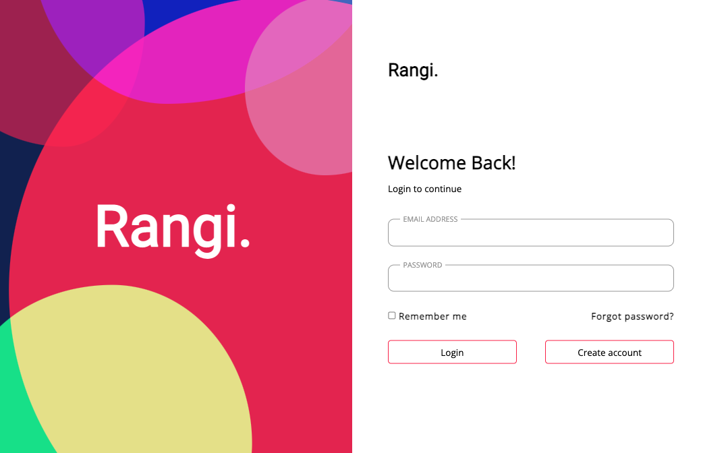

# Rangi

  

 

## 설명

로그인 페이지를 CSS의 `animation`, `transistion을` 사용하여 만든 프로젝트

- 라이브러리 사용x
- CSS
  - `transform`을 사용하여 원들을 배치
  - `animation`을 사용하여 움직이는 버블 애니메이션 구현
  - `mix-blend-mode`를 사용하여 원들이 겹치는 부분을 다른 색으로 나타나게함
